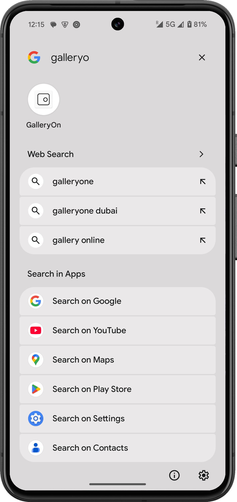
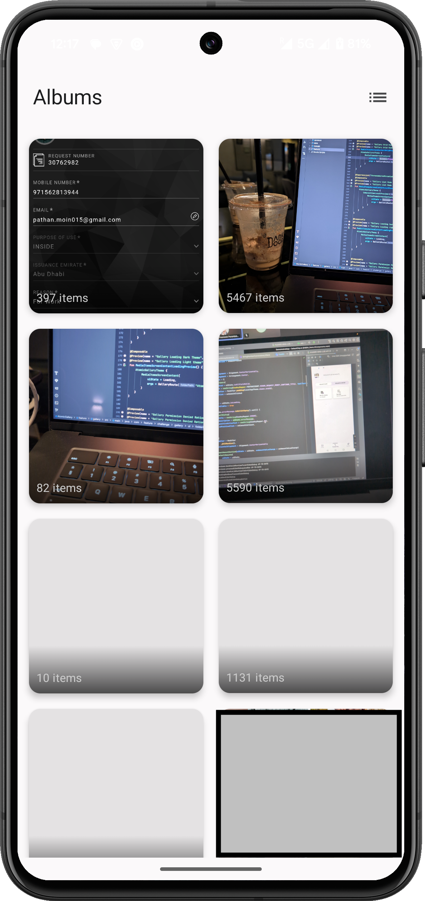
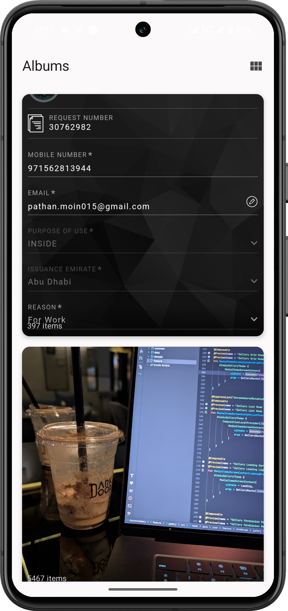
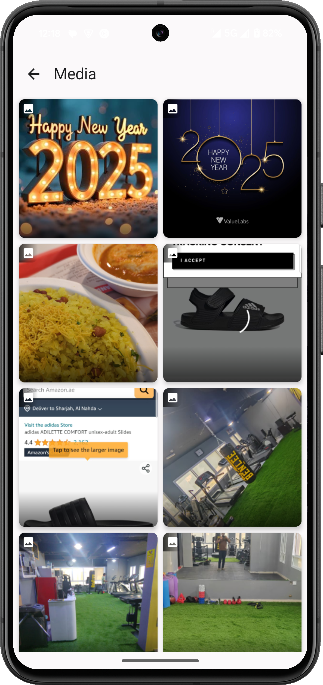
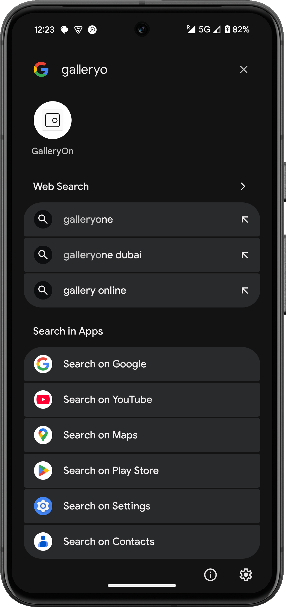
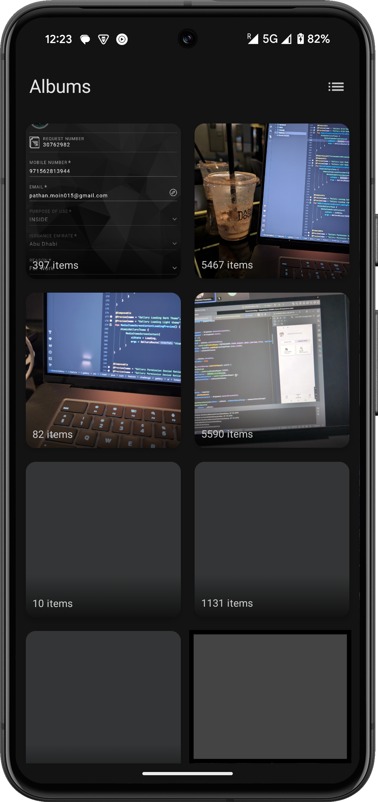
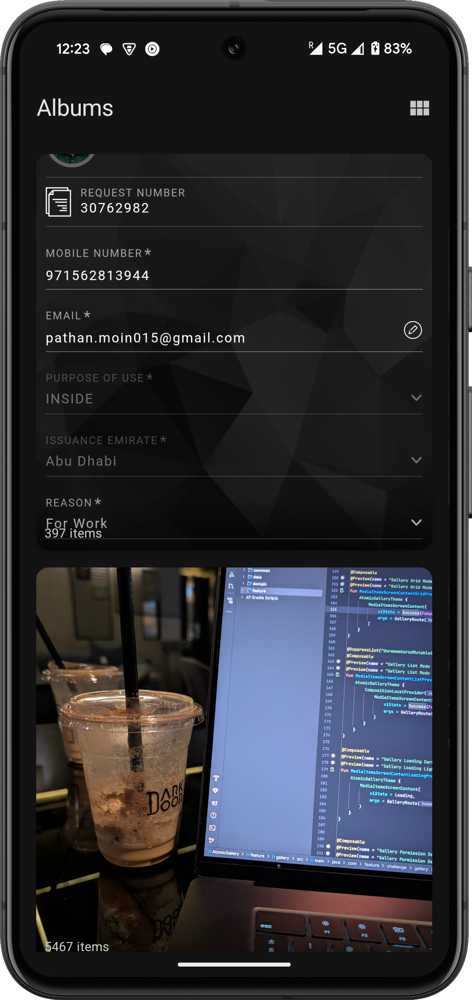
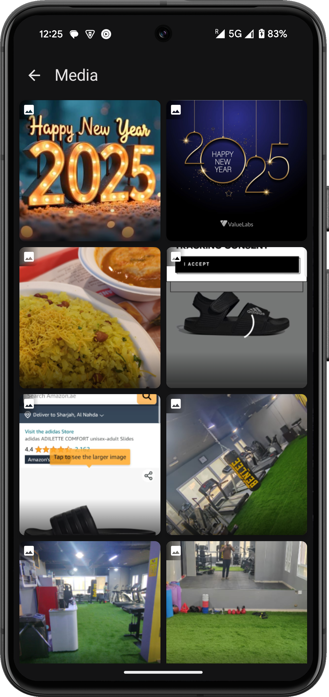

# ⚡ GalleryOn App

GalleryOn is a native Android application built in **Kotlin**, designed to showcase a clean, scalable, and modern approach to building a media gallery. The app uses best practices like modular clean architecture, Jetpack Compose for UI, and robust testing strategies.


## 📝 App Overview

1.  **Albums View**
    * Displays albums grouped by folders.
    * Supports switching between **Grid View** and **List View**.
    * Each album shows preview and media count.

2.  **Media Listing**
    * After selecting an album, displays media items (images/videos) within it.
    * Supports basic viewing of media metadata like name, size, and date.

3.  **Media Details**
    * Displays basic metadata of media items:
      * 🖼️ Media
      * 📄 Name
      * 📏 Size
      * 🗓️ Date Taken

4.  **Permission Handling**
    * Requests appropriate storage permissions at runtime based on Android version.


## 📸 Screenshots

### ☀️ Light Mode

| Launcher Screen |                          Album Screen (Grid)                          |                          Album Screen (List)                          |                        Media List Screen                        |                          Media Detail Screen                           |
|:---------------:|:---------------------------------------------------------------------:|:---------------------------------------------------------------------:|:---------------------------------------------------------------:|:----------------------------------------------------------------------:|
|  |  |  |  |  |


### 🌙 Dark Mode

| Launcher Screen |                           Album Screen (Grid)                           |                           Album Screen (List)                           |                         Media List Screen                         |                           Media Detail Screen                            |
|:---------------:|:-----------------------------------------------------------------------:|:-----------------------------------------------------------------------:|:-----------------------------------------------------------------:|:------------------------------------------------------------------------:|
|  |  |  |  |  |


## 🧠 Architecture

🧱 **Clean MVI + Modularized Architecture**  
Maintains strict separation of concerns between layers.

### 📁 Module Structure

| Module       | Description                                              |
|-------------------------|----------------------------------------------------------|
| `app/`                  | Application entry point and DI setup.                   |
| `core/`                 | Common utilities like permissions management.           |
| `domain/`               | Business models and use cases (pure Kotlin).            |
| `data/`                 | Repository implementations, media management.           |
| `feature/albums/`       | Albums screen, view models, UI components.               |
| `feature/media/`        | Media listing screen, view models, UI components.        |


## 🚀 Libraries & Tech Stack

### 🧰 Core Technologies

- **Kotlin** — Modern Android language.
- **Jetpack Compose** — Declarative UI toolkit.
- **Coroutines & Flow** — Async & reactive data streams.
- **Navigation (Compose)** — Type-safe screen navigation.
- **Hilt** — Dependency Injection framework.

### 🧪 Testing Libraries

- **JUnit4** — Unit testing framework.
- **MockK** — Mocks/stubs for testing.
- **Turbine** — Test Kotlin Flow emissions.


## 🧪 Testing Strategy

### 🧷 Unit Tests

- ✅ *ViewModel
- ✅ *Repository
- ✅ *UseCases

All tests utilize `MockK`, `Turbine`, and `Compose Test APIs`.

```bash
./gradlew clean test
```

## 💡 Thought Process

* Adopted a **Clean MVI** architecture to ensure clear separation of concerns and scalable code structure.
* Used **Jetpack Compose** for modern, declarative, and efficient UI development.
* Applied **Dagger-Hilt** for lightweight and easy-to-manage dependency injection.
* Focused heavily on **testability**, **modularization**, and **best Kotlin practices** for long-term maintainability.

# 📌 GalleryOn – Phase 2 Feature Backlog

| Priority | Feature                     | Module              | Description                                                                 | Status  | Target Milestone |
|----------|-----------------------------|---------------------|-----------------------------------------------------------------------------|---------|------------------|
| ⭐ High   | Smart Cleaner               | `feature-cleaner`   | Identify large files, duplicates, and low-quality media for cleanup.        | 🔜 Todo | v2.0.0           |
| ⭐ High   | Album Management            | `feature-albums`    | Create, rename, and delete custom albums.                                   | 🔜 Todo | v2.0.0           |
| ⭐ High   | Search Functionality        | `feature-search`    | Global search by name, date, tags, or file type.                            | 🔜 Todo | v2.1.0           |
| ⭐ High   | Tagging System              | `feature-tagging`   | Let users assign tags and filter media accordingly.                         | 🔜 Todo | v2.1.0           |
| ⭐ High   | Vault Mode (Private Albums) | `feature-vault`     | Add biometric-secured private albums.                                       | 🔜 Todo | v2.2.0           |
| ⭐ High   | Cloud Backup Integration    | `feature-cloud`     | Optional Google Drive/Dropbox backup for media.                             | 🧪 Idea | v2.3.0           |
| ⭐ Medium| Sort & Filter Controls      | `feature-media`     | Filter media by size, type, date; sort by date, name, or size.              | ✅ Done | v1.2.0           |
| ⭐ Medium| AI Categorization            | `feature-ai`        | Use ML Kit to categorize photos (e.g., people, travel, food).               | 🧪 Idea | v2.4.0           |
| ⭐ Medium| Media Editor Options         | `feature-edit`      | Crop, rotate, compress, or trim media within app.                           | 🧪 Idea | v2.5.0           |
| ⭐ Medium| Crash Reporting              | `core-analytics`    | Firebase Crashlytics integration for error monitoring.                      | 🔜 Todo | v2.0.0           |
| ⭐ Low   | Favorites View               | `feature-favorites` | Mark favorite media and access them quickly.                                | 🔜 Todo | v2.2.0           |
| ⭐ Low   | Custom Themes                | `feature-theme`     | Offer user-selectable themes (light/dark/custom accent colors).             | 🔜 Todo | v2.6.0           |
| ⭐ Low   | Sharing Suggestions          | `feature-share`     | Show nearby friends/devices to share media easily.                          | 🧪 Idea | v2.6.0           |


## 👨‍💻 Author

**Mirza Arslan**<br>
📧 mirzaarslan450@gmail.com<br>
🔗 [LinkedIn](https://www.linkedin.com/in/mirza-arslan/)

## 🧭 Final Thoughts

**GalleryOn** showcases a modern Android media application built with a focus on clean architecture, performance, and best development practices.  
The project emphasizes modularity, test coverage, scalability, and a smooth user experience.  
Feel free to explore it, and suggestions for improvements are always welcome! 🚀


